# Aim of the project

## 
{ width=65% }

- Measure the time response of the charge density on the surface 

##
{ width=65% }

- Measure the current flow through a known resistor 

## Piezo-electric materials
- generate an electric charge in response to applied mechanical stress

. . . 

**Constitutive equations:**
$$S = s_E \cdot T + d^t \cdot E$$
$$D = d \cdot T + \epsilon_T \cdot E$$

- **S** = Strain; T = Stress; 
- **D** = charge-density displacement; **E** = Electric field;
- **d** = piezo-electric co-efficients; $\mathbf{\epsilon}$ = permittivity

## Simulation setup
- We use the Piezo-electricity Multiphysics setup in COMSOL, by interfacing the *Structural Mechanics* and *Electrostatics* modules.

- **Structural Mechanics:** Face B is set to a *fixed constraint*, and the force is applied on the material on Face A as a *boundary load*.
- **Electrostatics:** Face B is set to *ground potential*, and Face A is set to *floating potential*, which acts as a perfectly conducting electrode.

## 2D Axi-symmetric model
{ width=50% }

- 2D model is revolved around r = 0 axis to produce 3D result.
- radius 300 microns
- time range = $(0, 10^{-5}, 7.5\cdot 10^{-2})$ *sec*

## Step load (sigmoid)
|{ width=100% }| { width=87.5% }|
|--------------|-------------|

## Delta fn load (gaussian)
|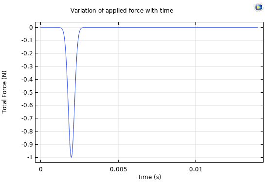{ width=100% }| { width=87.5% }|
|--------------|-------------|

# Results (Part 1)

## PZT-5A, 150 micron 

### Step load:
| | |
| ----------- | ----------- |
|{ width=100% }| { width=100% }|

## PZT-5A, 150 micron 

### Charge density distribution
| | |
| ----------- | ----------- |
|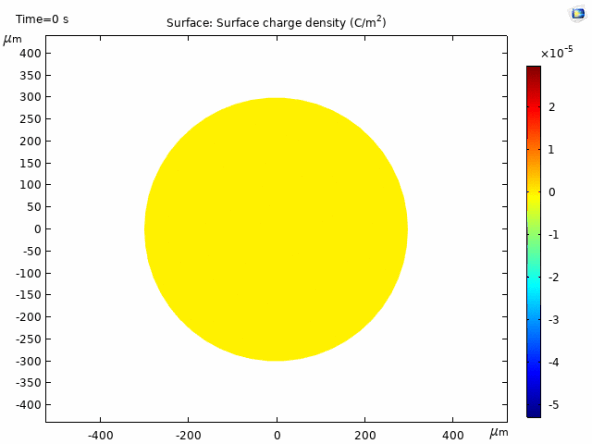{ width=100% }|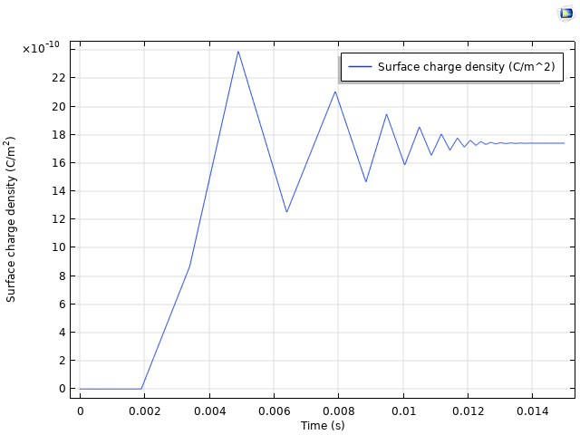{ width=89% }|

## PZT-5A, 150 micron 

### Gaussian load:

| | |
| ----------- | ----------- |
|{ width=100% }|{ width=75% }|

## PZT-5A, 150 micron 

### Charge/Potential change over time
| | |
| ----------- | ----------- |
|{ width=100% }|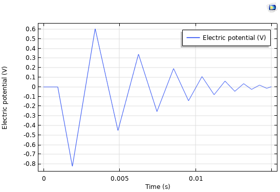{ width=100% }|

## PZT-5A, 750 micron 

### Gaussian load:
| | |
| ----------- | ----------- |
|{ width=100% }|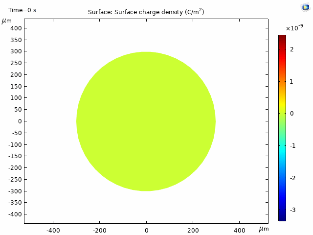{ width=75% }|

## PZT-5A, 750 micron 

### Charge/Potential change over time
| | |
| ----------- | ----------- |
|{ width=100% }|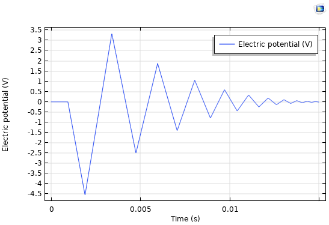{ width=100% }|

## PVDF, 150 micron 

### Step load:
| | |
| ----------- | ----------- |
|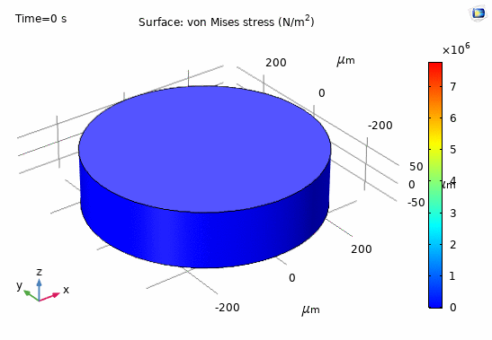{ width=100% }| { width=100% }|

## PVDF, 150 micron 

### Charge density distribution
| | |
| ----------- | ----------- |
|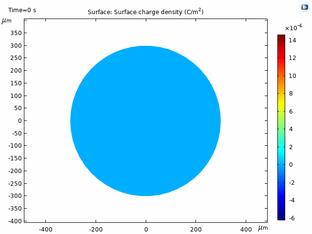{ width=75% }|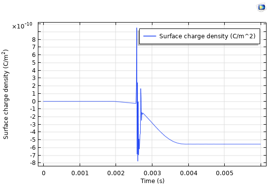{ width=100% }|

## PVDF, 150 micron 

### Gaussian load:

| | |
| ----------- | ----------- |
|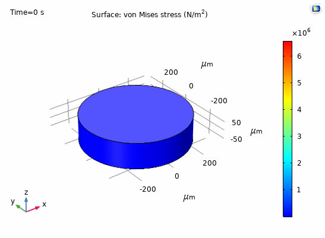{ width=100% }|{ width=80% }|

## PVDF, 150 micron 

### Charge/Potential change over time
| | |
| ----------- | ----------- |
|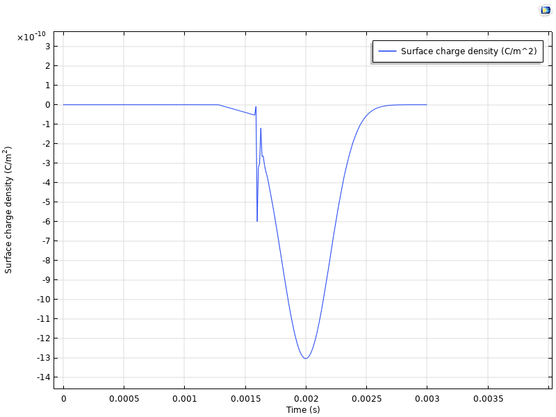{ width=100% }|{ width=100% }|

## PVDF, 750 micron 

### Gaussian load:

| | |
| ----------- | ----------- |
|{ width=75% }|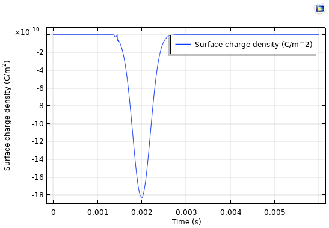{ width=100% }|

